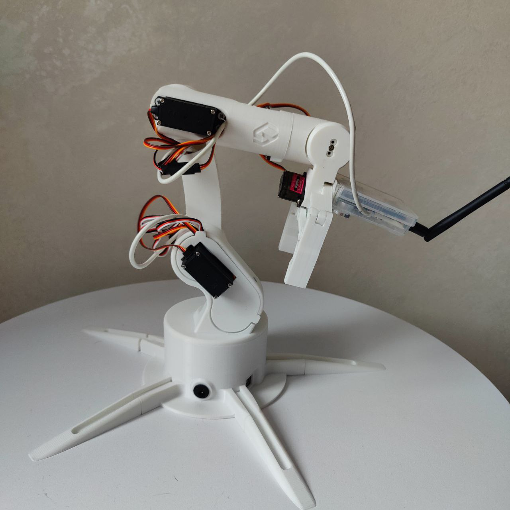
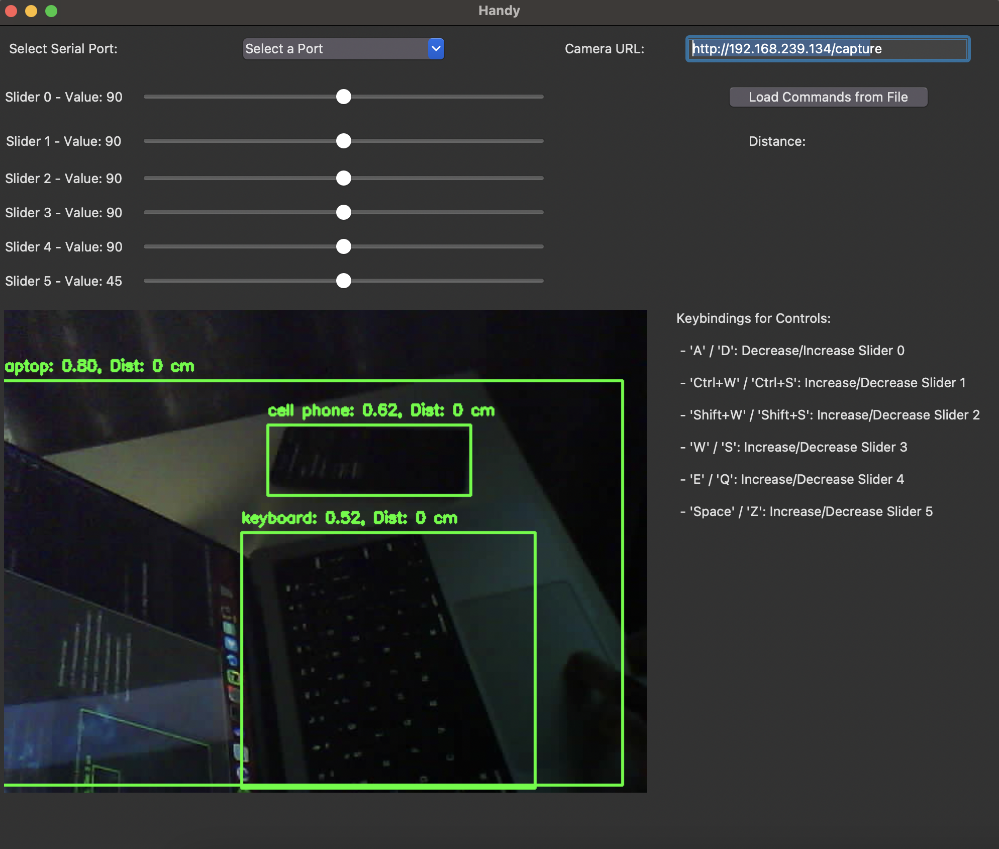

# Handy
 University project for robotic arm

# Overview

### Components:
    - Arduino UNO
    - MG995 servo x3
    - MG90s servo x3
    - ESP32 cam 
    - HC-SR04 (ultrasonic sensor)
    - INA3221
    
### Functionality
    - Realtime hand interaction
    - Run commands from file
    - Video live streaming
    - Detecting objects
    - Detecting distance to object

### Photos
#### Hand

#### UI

# Resources
    - AI Model - YOLOv4 (weights: [https://github.com/AlexeyAB/darknet/releases/download/darknet_yolo_v3_optimal/yolov4.weights])
